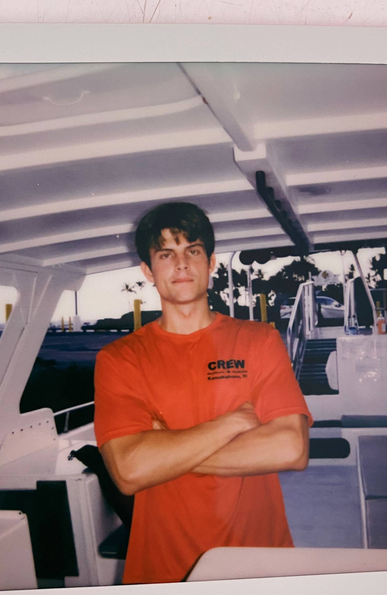

  <a href="{{ '/' | relative_url }}" class="button">Main</a>

Hello!
-
My name is Isaiah Broderson, I am a computer science student currently studying at the University of Hawai'i Hilo. This is a personal project I have decided to undertake with the hopes of gaining a deeper understanding of data-oriented design and systems-level programming while also testing and expanding upon my knowledge of mathematics, physics, and logical problem solving. Although this project is still in its early stages I have found it has allowed me to really get a good feel for the importance of performance optimization and see first-hand the cause and effect of faulty memory management. I have been able to experience the root fundamentals of how data relates to and interacts with systems, which in turn has led to a strengthining in my understanding of software-hardware interaction.
